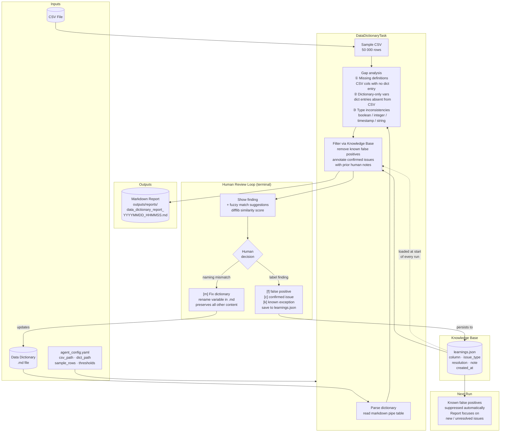

# Data Quality Agent — Architecture

## Component summary

| Component | File | Purpose |
| --- | --- | --- |
| Runner | `agent/runner.py` | CLI entry point, loads config, calls tasks then review |
| Task — Data Dictionary | `agent/tasks/data_dictionary.py` | Gap detection: missing definitions, extra vars, type conflicts |
| Task — Missing Values | `agent/tasks/missing_values.py` | Null profiling: always-null, high-null columns |
| Task — Data Types | `agent/tasks/data_types.py` | Column profiling: semantic type, cardinality, stats, samples |
| Task — Impossible Values | `agent/tasks/impossible_values.py` | Domain rule evaluation: range, date order, logical dependency |
| Task — Invalid Entries | `agent/tasks/invalid_entries.py` | Format checks: enum, regex pattern, placeholder detection, whitespace |
| Task — Outliers | `agent/tasks/outliers.py` | IQR + Z-score on numeric columns; temporal outliers on timestamps |
| Task — Categorical Cleaning | `agent/tasks/categorical_cleaning.py` | Case variants, fuzzy near-duplicates (difflib), low-frequency categories |
| Reviewer | `agent/review/reviewer.py` | Interactive terminal loop, fuzzy suggestions, dictionary fix |
| Knowledge Base | `knowledge/knowledge_base.py` | Load / save / query learnings.json |
| Config | `projects/<name>/agent_config.yaml` | Per-project paths and thresholds |
| Learnings | `projects/<name>/knowledge/learnings.json` | Human decisions, isolated per project |

## The feedback loop in plain English

1. **Run** — agent compares CSV against dictionary, filters anything already reviewed, writes report
2. **Review** — human labels each finding; naming mismatches can fix the dictionary in place
3. **Learn** — labels persist to `learnings.json`
4. **Next run** — false positives are silently suppressed; the report shrinks to only what is new or unresolved
